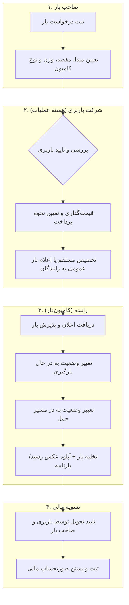

# سند جامع محصول: پلتفرم هوشمند مدیریت و ارسال بار (Baaar)
> **نسخه:** 1.0.0  
> **دیدگاه:** مدیریت محصول (Product Management / PM Spec)  
> **تاریخ:** مرداد ۱۴۰۵ (July 2026)  

---

## ۱. چشم‌انداز و خلاصه مدیریتی (Executive Summary & Vision)

### ۱.۱. چشم‌انداز (Vision Statement)
تبدیل شدن به یکپارچه‌ترین و هوشمندترین اکوسیستم ترابری و باری کشور که ارتباط میان **صاحبان بار (صنایع و تجار)**، **شرکت‌های باربری و تسریع‌کنندگان ترابری (Freight Forwarders)** و **رانندگان ناوگان سنگین و نیمه‌سنگین (کامیون‌داران)** را شفاف، چابک، و اقتصادی می‌سازد.

### ۱.۲. خلاصه مدیریتی (Executive Summary)
صنعت حمل‌ونقل جاده‌ای بار در ایران به شکل سنتی، جزیره‌ای و بر پایه ارتباطات تلفنی، فیزیکی و واسطه‌گری عمیق اداره می‌شود. **پلتفرم بار (Baaar)** با تمرکز اولیه بر مدل **B2B2C (صاحب بار ➔ شرکت باربری ➔ راننده)** و بهره‌گیری از همکاری استراتژیک با شرکت‌های باربری پیشرو، پلتفرمی دیجیتال برای مدیریت چرخه حیات بار از ثبت درخواست، قیمت‌گذاری و صدور حواله/بارنامه تا تخصیص ناوگان، ردیابی، و تسویه حساب مالی فراهم می‌کند.

---

## ۲. صورت مسئله و فرصت‌های بازار (Problem Statement & Market Opportunity)

### ۲.۱. چالش‌های ذینفعان در وضعیت کنونی (As-Is State)

| ذینفع | چالش‌های فعلی |
| :--- | :--- |
| **صاحبان بار (شرکت‌ها / تجار)** | عدم شفافیت قیمت، عدم امکان ردیابی آنلاین وضعیت بار، تاخیر در تخصیص کامیون مناسب، فقدان سوابق یکپارچه مالی و گزارش‌گیری بارهای ارسال‌شده. |
| **شرکت‌های باربری** | اتلاف زمان بالا در هماهنگی‌های تلفنی، سختی پیدا کردن رانندگان مطمئن در ایام شلوغ، پیچیدگی مدیریت تسویه‌حساب با صاحبان بار و رانندگان، خطاهای انسانی در صدور حواله و بارنامه. |
| **رانندگان (کامیون‌داران)** | زمان معطلی بالا در پایانه‌های باربری جهت اعلام بار، حق کمیسیون غیرشفاف واسطه‌ها، خواب سرمایه و ناوگان، خطرات عدم تسویه به موقع کرایه توسط باربری یا صاحب بار. |

### ۲.۲. فرصت بازار (Opportunity)
دیجیتالی‌سازی ناوگان و ایجاد یک نرم‌افزار مدیریت ترابری (TMS) مجهز به بازارگاه اعلام بار (Load Board Market) به شرکت‌های باربری اجازه می‌دهد ظرفیت عملیاتی خود را چند برابر کنند، بدون اینکه نیاز به افزایش نیروی انسانی داشته باشند.

---

## ۳. پرسونای ذینفعان و ارزش‌های پیشنهادی (Stakeholder Personas & Value Proposition)

### ۳.۱. پرسونای اول: صاحب بار (Shipper Persona)
- **کیست؟** مدیر لاجستیک یک کارخانه تولیدی، بازرگان یا مشتری خرد که نیازمند حمل کالا از مبدا به مقصد مشخص است.
- **نیازمندی‌ها:** سرعت در دریافت اعلام قیمت، اطمینان از سلامت کالا و بیمه، ردیابی آنلاین روند حمل، دریافت قبوض و فاکتور رسمی.
- **ارزش پیشنهادی ما (Value Prop):** ثبت آسان درخواست بار، دسترسی به نرخ شفاف، پیگیری زنده چرخه ارسال و بایگانی دیجیتال اسناد.

### ۳.۲. پرسونای دوم: شرکت باربری / اپراتور (Freight Company Admin Persona)
- **کیست؟** مدیر یا اپراتور باربری دارای مجوز که مسئولیت پاسخگویی به صاحبان بار، صدور اسناد و تخصیص ناوگان را دارد.
- **نیازمندی‌ها:** سیستم مدیریت سفارشات (Order Management)، ابزار سریع تخصیص راننده، داشبورد مدیریت مالی و کمیسیون، مدیریت مدارک (بارنامه/پای‌بار/رسید).
- **ارزش پیشنهادی ما (Value Prop):** کاهش ۹۰ درصدی تماس‌های تلفنی، کنترل لحظه‌ای ناوگان، خودکارسازی تسویه‌حساب‌ها و نرخ بهینه‌تر پذیرش سفارش.

### ۳.۳. پرسونای سوم: راننده / کامیون‌دار (Trucker/Driver Persona)
- **کیست؟** راننده مالک یا راننده شرکتی کامیون/تریلی که در جاده‌ها مشغول حمل بار است.
- **نیازمندی‌ها:** دسترسی سریع به بارهای مناسب بر اساس نوع خودرو و مسیر، قیمت منصفانه، عدم معطلی، تسویه‌حساب سریع و بدون دردسر.
- **ارزش پیشنهادی ما (Value Prop):** دریافت هوشمند بار روی گوشی، شفافیت کرایه، کاهش خواب کامیون و سهولت ثبت اعلام تحویل.

---

## ۴. معماری محصول و چرخه عملیاتی (Product & Operational Workflow)

---

## ۵. نقشه راه محصول و سطح‌بندی ویژگی‌ها (Product Roadmap & Feature Scope)

### فاز ۱: کمینه محصول پذیرفتنی (MVP) - تمرکز B2B2C با شرکت باربری همکار
- **پورتال صاحب بار:** فرم ساده ثبت بار + مشاهده لیست و استاتوس لحظه‌ای بارهای خود.
- **داشبورد باربری (Freight Admin Panel):** 
  - مدیریت بارهای ورودی (تایید/رد، قیمت‌گذاری).
  - بانک اطلاعاتی رانندگان طرف قرارداد.
  - تخصیص دستی بار به راننده مشخص.
  - داشبورد خلاصه وضعیت بارها و پرداخت‌های دستی (نقدی/اعتباری/پای‌بار).
- **وب‌اپلیکیشن رانندگان (Driver Web-App / PWA):**
  - مشاهده کارت بار تخصیص داده شده.
  - دکمه‌های گام‌به‌گام تغییر استاتوس (*پذیرش ➔ بارگیری ➔ در مسیر ➔ تحویل شد*).
  - ابزار دوربین/آپلود برای ثبت عکس رسید بارنامه و تحویل (Proof of Delivery).
- **سیستم نقش‌ها (Mock Authorization / Role Switcher):** امکان سوییچ سریع بین ۳ نقش جهت تست میدانی چابک.

### فاز ۲: توسعه و هوشمندسازی (Growth Phase)
- **الگوریتم پیشنهاد هوشمند بار به رانندگان:** بر اساس موقعیت جغرافیایی، نوع بارگیر و سابقه راننده.
- **درگاه پرداخت آنلاین و کیف پول:** امکان پرداخت بیعانه، کرایه آنلاین و کسر خودکار کمیسیون.
- **ردیابی زنده زپ/GPS:** مشاهده موقعیت کامیون روی نقشه به صورت زنده برای باربری و صاحب بار.
- **سیستم مناقصه / استعلام قیمت (Bidding System):** امکان ثبت قیمت پیشنهادی توسط رانندگان.

### فاز ۳: مقیاس‌پذیری و اکوسیستم (Scale & Enterprise)
- **اتصال به سامانه جامع تجارت و راهداری:** استعلام خودکار کارت هوشمند راننده و بارنامه دولتی.
- **باشگاه رانندگان و خدمات جانبی:** ارائه خدمات سوخت، لاستیک، بیمه بار و تسهیلات.
- **پنل سازمانی برای کارخانجات بزرگ:** APIهای اختصاصی برای سیستم‌های ERP سازمانی (SAP, راهکاران و ...).

---

## ۶. مدل کسب‌وکار و درآمدی (Business & Revenue Model)

1. **مدل کمیسیون از هر حمل (Commission per Load):** اخذ درصد مشخصی (مثلاً ۳٪ تا ۸٪) از کرایه بار به عنوان کارمزد پلتفرم.
2. **حق اشتراک نرم‌افزار باربری (SaaS Subscription):** دریافت هزینه ماهیانه/سالانه از شرکت‌های باربری جهت استفاده از داشبورد مدیریتی، انبار داده و ابزارهای اتوماسیون.
3. **خدمات ارزش افزوده (Value-Added Services):** ارائه بیمه مسئولیت حمل، ردیابی پیشرفته و خدمات مالی/اعتباری به صنایع.

---

## ۷. شاخص‌های کلیدی موفقیت (Key Performance Indicators - KPIs)

- **Time-to-Assign (زمان تخصیص):** میانگین زمان از ثبت بار توسط مشتری تا تایید و اساین شدن راننده (هدف MVP: زیر ۳۰ دقیقه).
- **Fulfillment Rate (نرخ موفقیت حمل):** درصد بارهای ثبت‌شده که با موفقیت تحویل داده می‌شوند (هدف: بالای ۹۵٪).
- **Driver Retention (ماندگاری راننده):** درصد رانندگانی که بیش از ۳ بار در ماه از طریق پلتفرم بار حمل می‌کنند.
- **Freight Co Efficiency Index:** میزان کاهش زمان تلف‌شده اپراتورهای شرکت باربری همکار برای مدیریت سفارشات.

---

## ۸. چالش‌ها، مخاطرات و راهکارهای مواجهه (Risks & Mitigation)

| چالش / خطر | سطح اثر | راهکار مواجهه (Mitigation Strategy) |
| :--- | :--- | :--- |
| **مقاومت رانندگان سنت‌گرا در برابر نصب نرم‌افزار** | بالا | طراحی PWA بسیار ساده بدون نیاز به نصب از استورها، امکان ارسال لینک اس‌ام‌اس مستقیم برای هر بار. |
| **عدم دقت در ثبت اطلاعات بار توسط مشتری** | متوسط | استانداردسازی فرم‌های ثبت بار با منوهای دراپ‌داون انتخابی و تایید اجباری توسط اپراتور باربری. |
| **تاخیر یا عدم ارائه مدرک تحویل (POD)** | متوسط | منوط کردن تسویه حساب نهایی راننده به آپلود عکس خوانا از اسناد تحویل در وب‌اپ. |

---

## ۹. گام‌های بعدی در سمت مدیریت محصول (Next PM Steps)

1. **جلسه هم‌راستاسازی با مدیران شرکت باربری همکار:** مرور این سند با اپراتورها و مدیر باربری جهت اطمینان از پوشش ۱۰۰٪ نیازمندی‌های روزمره آن‌ها.
2. **طراحی Wireframeها و سناریوهای کاربری (User Stories):** استخراج دقیق داستان‌های کاربر برای دسکتاپ و موبایل.
3. **تعریف شاخص‌های تست پایلوت (Pilot Testing Plan):** اجرای تست عملیاتی روی ۱۰ تا ۵۰ بار واقعی در یک هفته.
